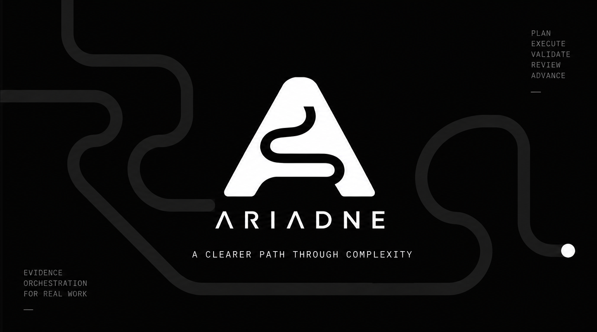

# Ariadne

**Evidence-driven execution for complex creative and technical work.**

Ariadne is an execution engine that chooses the right form of intelligence for each part of a task. Deterministic code handles what can be known exactly. Bounded Decision Intelligence handles closed judgments. Generative models handle creation and open-ended reasoning. Verification establishes what actually happened, and protected decisions stay under human control.

Every important action remains tied to evidence, verification and explicit authority.

> **Code before judgment. Judgment before generation. Evidence after action.**

> **Spend only what the task earns.**

## The core idea

Before Ariadne spends any intelligence, it asks one question:

```text
Task
 │
 ▼
Can code know it?
 │
 ├─ yes → deterministic execution
 │
 └─ no
      ▼
Can it be a bounded judgment?
 │
 ├─ yes → Decision Plane
 │
 └─ no
      ▼
Generative execution
 │
 ▼
Verification
 │
 ▼
Human control when required
```

A fact that a check, a digest or a recorded approval can settle is never sent to a model. A judgment with a closed answer space becomes a bounded decision with a declared option set. Only work that genuinely needs creation or open reasoning reaches a generative worker, and even then the result is verified before it counts.

You do not need to know the internals to use Ariadne, and none of the vocabulary above is a prerequisite. It is simply how the engine avoids expensive answers to cheap questions.

## Product principles

- **Code before judgment.** If computation can establish the answer, Ariadne computes it and consults nothing else.
- **Judgment before generation.** A closed question with a declared answer space is a bounded decision, not a prompt.
- **Evidence after action.** Each step produces a record bound to an identity and a revision, so a claim never quietly becomes a verified outcome.
- **Spend only what the task earns.** A task that needs no generative model is never given one.

## What makes Ariadne different

### Adaptive execution

Ariadne routes a task by its difficulty, its stakes, the capabilities actually available and the evidence already recorded, instead of applying one workflow to every request.

### Decision Intelligence

Closed judgments are answered by bounded decision providers that return a value inside a declared option set. A deterministic provider ships in the box and needs no paid API, so the default path works offline.

### Generative workers

Open-ended creation still uses capable generative models where they earn their cost, through your own agent or an adapter you select.

### Verification

A worker's claim is not a verified outcome. Verification binds the executing attempt, the revision and the evidence, and stale evidence stops satisfying a gate.

### Design Intelligence

References, an approved design direction, rendered evidence and an independent critique are first-class records rather than prose, and they stay current as the work is revised.

### Human control

Confidence never grants authorization. Direction, dependencies, completion, shipping and publishing stay behind human gates that the engine cannot open for you.

### Context economics

Ariadne tracks what context, tools and work actually contributed to a verified result, and reports unknown when a value cannot be measured.

## How it works

```text
                 ARIADNE
                    │
        ┌───────────┼───────────┐
        │           │           │
 deterministic   bounded     generative
    logic        decisions      work
        │           │           │
        └───────────┼───────────┘
                    ▼
               verification
                    ▼
               human control
```

Around that core, Ariadne keeps adaptive context (only the sources a stage needs), provenance (who or what acted, on which revision), design intelligence and task-level economics. The engine enforces the transitions; a later edit can invalidate earlier evidence without deleting it.

## Install

Ariadne installs from immutable GitHub release artifacts. It is not published to PyPI: the `ariadne` distribution name already belongs to the unrelated Ariadne GraphQL project, so a plain `pip install ariadne` would fetch the wrong package.

Ariadne needs Python 3.10 or newer. For the `$ariadne` workflow it also uses Codex, or an adapter you configure.

```bash
python -m pip install --user "https://github.com/tanishkfr/ariadne/releases/download/v2.0.0/ariadne-2.0.0-py3-none-any.whl"
python -m ariadne install 
python -m ariadne doctor
(or py -m ariadne install)
```

`python -m ariadne --version` reports the active version. The launcher keeps an immutable runtime under the platform data directory and registers the managed skill at `~/.agents/skills/ariadne` unless an Ariadne-owned skill is already active there.

| Platform | Ariadne data directory |
|---|---|
| Windows | `%LOCALAPPDATA%\Ariadne` |
| macOS | `~/Library/Application Support/Ariadne` |
| Linux | `$XDG_DATA_HOME/ariadne`, otherwise `~/.local/share/ariadne` |

If `python -m pip show ariadne` describes a GraphQL library, stop and use a separate Python environment. The two distributions cannot coexist in one environment. More detail is in [Installation](docs/guides/INSTALL.md).

## Quick start

1. Run `python -m ariadne doctor` and confirm the runtime, the managed skill and compatible project state.
2. Open Codex in the project you want to work on and type `$ariadne`.
3. Describe the outcome you want in ordinary language. Ariadne finds an unfinished run, safely adopts an existing repository, or begins a new project.
4. At each gate it pauses for your decision, then continues from the recorded state.

A fully deterministic, model-free introduction lives in [examples/README.md](examples/README.md). The examples call the same engine the command line uses and need no provider:

```bash
python examples/01_basic_task.py
python examples/04_bounded_decision.py
```

## A short walkthrough

Suppose you ask Ariadne to fix a failing validation in a source file. In outline, it will:

1. characterise the task and record what kind of work it is;
2. establish the facts code can know, such as which files changed and what the checks currently report;
3. use bounded judgment only where classification is genuinely ambiguous;
4. hand the bounded work to a worker with an explicit scope and acceptance checks;
5. reproduce the result independently instead of trusting the worker's summary;
6. repair once when policy allows, and stop for a human otherwise;
7. append the evidence, so the next step reads a record rather than a recollection.

No step can promote itself, and nothing is accepted on the strength of a claim alone.

## Decision Intelligence

Ariadne does not send every uncertain question to a large generative model. It first asks whether code can answer the question, whether the answer space can be bounded, and whether generation would add real value.

When a question is genuinely bounded, the Decision Plane compiles it into a declared option set, projects only the state that question needs, batches independent questions together, and reuses an answer only when the same state and provider version produced it. If the evidence is insufficient or confidence is unusable, it escalates rather than guessing; a protected action is refused under every confidence value. Every decision records where its confidence came from.

The mechanism is documented in [Decision Intelligence](docs/v2/AR-205D/01-DECISION-COMPILER.md). A Jev-shaped adapter boundary is one example of a possible bounded-decision provider; it is not required, and no live Jev evaluation was executed.

## Verification and human control

Ariadne keeps five things apart, and none of them substitutes for another:

```text
Decision      ≠  Authorization
Execution     ≠  Verification
Verification  ≠  Acceptance
```

An approval binds a gate, a target, a revision and an identity. A review binds two distinct executions, so an implementer cannot certify their own work. An acceptance spends exactly one human approval. The engine can stop and ask, and it cannot manufacture the answer.

The full statement of what the engine does and does not guarantee is in [Trust boundaries](docs/guides/TRUST.md).

## Design Intelligence

For design work, Ariadne records a provenance chain: requirements, reference findings (found, inspected, analysed or used), component candidates, an approved direction, rendered evidence with its capture parameters, an independent critique, and bounded refinements that stay inside their declared scope.

This is not an automatic taste oracle. Source inspection cannot close a rendered-quality requirement, and a screenshot without capture provenance is not evidence. The chain records what was actually checked.

## Providers

Ariadne is provider-neutral. Four kinds of component are separated by contract:

```text
deterministic providers
decision providers
generative providers
verification adapters
```

No particular paid provider is required by the core engine, and the deterministic path is offline. A missing optional provider is recorded as capability state rather than crashing the run, and the capability registry is the source of truth for what is actually available. A versioned, provider-neutral consumer contract lets another application drive the engine without importing any vendor SDK; see [Integration protocol](docs/v2/AR-205/04-INTEGRATION-CONTRACT.md).

## Benchmarks

The deterministic suite runs offline with no model calls and no network. The v2 release was evaluated as follows:

```text
Full benchmark: 295 cases
Fail: 0
Error: 0

Engine checks: 578/578
Release tests: 97/97
Wheel install: 14/14
Release subset: 56/56
```

`OBSERVED` and `DECLARED_SKIP` are deliberate categories, separate from failure: an observation records a measurement without a judgement, and a skip means a case declared itself not executable in this environment. Neither is counted as a pass. The benchmark proves deterministic mechanics, not model output quality, cost or a success rate. See [benchmarks/README.md](benchmarks/README.md).

## Migration from v1

Existing v1 projects keep working without migration. A run state written before the engine contract is refused until you migrate it, and migration is explicit, dry-runnable, backed up and additive:

```bash
python -m ariadne migrate --dry-run --project <project>
python -m ariadne migrate --apply --project <project>
```

An apply preserves the pre-migration bytes and creates no approval, review or verification record. Rollback restores the preserved bytes while that remains honest, and refuses once v2-only work exists. The full guide is [MIGRATING-v1-to-v2.md](docs/guides/MIGRATING-v1-to-v2.md).

## Updates, rollback and removal

Updates download and verify a newer release, and rollback returns to the previous installed version:

```bash
python -m ariadne update
python -m ariadne rollback
(or py -m ariadne update)
```

Removal is two explicit steps:

```bash
python -m ariadne uninstall
python -m pip uninstall ariadne
```

The first command removes the user-local runtime and the managed skill while preserving Projects, project documents, evidence, source files, edited instructions and unrelated user files. The second removes the Python launcher; confirm it is gone with `python -m pip show ariadne`.

## Trust and limitations

Ariadne enforces its own state transitions, approval binding, revision freshness, evidence contracts, review independence and bounded decision contracts. It is honest about what it cannot do:

- it does not sandbox your operating system or jail a validation command;
- it does not cryptographically attest local run-state files;
- it cannot prove an observation a provider never reported;
- it keeps external text as data, but cannot make a model immune to prompt injection inside its own authority;
- its artifacts are authenticated by digest, not signed by a maintainer key;
- one install path was verified on one platform; other platforms use the same Python entry point but were not executed here;
- migration rollback stops being available once v2-only work exists.

These are stated precisely in [TRUST.md](docs/guides/TRUST.md).

## Documentation

- [Quick start](docs/guides/QUICKSTART.md) · [Installation](docs/guides/INSTALL.md) · [Getting started](docs/guides/GETTING-STARTED.md)
- [Updates and rollback](docs/guides/UPDATE.md) · [Troubleshooting](docs/guides/TROUBLESHOOTING.md)
- [Python and CLI API](docs/v2/AR-205/06-RELEASE-API.md) · [Integration protocol](docs/v2/AR-205/04-INTEGRATION-CONTRACT.md)
- [Architecture](docs/v2/AR-200/03-ARCHITECTURE.md) · [Workflow](docs/policies/WORKFLOW.md) · [Router](docs/policies/ROUTER.md)
- [Decision Intelligence](docs/v2/AR-205D/01-DECISION-COMPILER.md) · [Decision Graph](docs/v2/AR-205D/02-DECISION-GRAPH.md)
- [Design Intelligence](docs/v2/AR-202D/02-REFERENCE-INTELLIGENCE.md) · [Design direction](docs/v2/AR-202D/04-DESIGN-DIRECTION.md) · [Design taste](docs/policies/DESIGN-TASTE.md)
- [Trust boundaries](docs/guides/TRUST.md) · [Privacy](docs/policies/PRIVACY-POLICY.md) · [Model routing](docs/policies/MODEL-ROUTING.md)
- [Migration guide](docs/guides/MIGRATING-v1-to-v2.md) · [Examples](examples/README.md) · [Benchmarks](benchmarks/README.md)
- [Release notes](RELEASE-NOTES.md) · [Changelog](CHANGELOG.md)

## Licence

Ariadne is available under the [Apache License 2.0](LICENSE).
